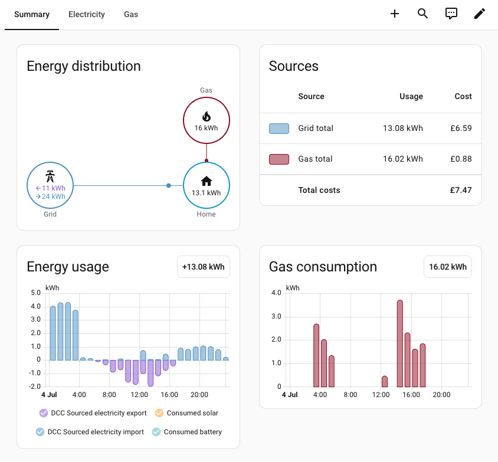
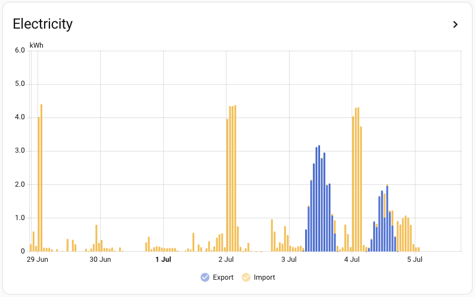

# ha-glowmarkt

Home Assistant custom integration for Glowmarkt/Bright smart-meter accounts in Great Britain.

> This is an unofficial community project. It is not affiliated with, endorsed by, or supported by Glowmarkt, Bright, or Hildebrand.

Glowmarkt runs the consumer service behind the Bright app for many UK smart-meter users.
If your electricity or gas meter data is available in Bright, Glowmarkt is already collecting and exposing that data on your account, typically as daily and half-hourly usage, cost, tariff, and in some cases export readings.

This integration does not talk directly to your meter.
It signs in to your Bright/Glowmarkt account and imports the data that Glowmarkt already makes available there into Home Assistant.

For accounts with DCC-backed resources, that means Home Assistant can use the same underlying Glow data that the Bright app is using, including delayed half-hour history and export data when Glow exposes it.

This project started as an effort to add electricity export metrics to the [jonandel/ha-hildebrand-dcc](https://github.com/jonandel/ha-hildebrandglow-dcc) integration, but it grew into a complete reimplementation.
This integration can run alongside the original.

Implementation is based on the published Bright individual-user PDF and the live Resource System Swagger:

- [Glowmarkt API Description Individual User for Bright (PDF)](https://docs.glowmarkt.com/GlowmarktAPIDataRetrievalDocumentationIndividualUserForBright.pdf)
- [Glow Platform Resource System Swagger](https://api.glowmarkt.com/api-docs/v0-1/resourcesys/)

## What it does

- Creates one canonical electricity meter device and one canonical gas meter device per Glow virtual entity.
- Exposes half-hour electricity import, electricity export, gas usage, and cost data.
- Exposes `Usage (today)` and `Cost (today)` for supported meters.
- Exposes `Export (today)` on the canonical electricity meter when Glow provides a direct `electricity.export` resource.
- Exposes tariff `Standing charge` and `Rate` entities, disabled by default.
- Imports canonical half-hourly historical usage, export, and cost data into Home Assistant.
- Triggers Glow DCC `catchup` requests during the history refresh loop for canonical DCC-backed resources.
- Uses Glow `last-time` timestamps to avoid importing clearly stale future DCC hours.

## Installation

### HACS

Add this repository as a custom integration in HACS, then install `Glowmarkt`:

[](https://my.home-assistant.io/redirect/hacs_repository/?owner=cjw85&repository=ha-glowmarkt)

If you add it manually, use:

- Owner: `cjw85`
- Repository: `ha-glowmarkt`
- Category: `Integration`

After installing or updating through HACS, restart Home Assistant before adding or reloading the integration.

### Manual

Copy `custom_components/glowmarkt/` into your Home Assistant `config/custom_components/` directory and restart Home Assistant.

## Setup

After restart, add the integration in Home Assistant and search for `Glowmarkt`.

[](https://my.home-assistant.io/redirect/config_flow_start/?domain=glowmarkt)

Use your Bright/Glowmarkt email address and password.

The integration creates devices from the account structure returned by Glow.
Sensors may appear as unavailable for a few seconds on first setup while the initial refresh completes.

> Example names in this README such as `DCC Sourced electricity import` are only examples taken from one Glow account.
> Your actual device/entity/statistic names are derived from Glow's own virtual-entity name for the site or property.

Recorder-backed history import requires Home Assistant's `recorder` integration to be enabled (it normally is by default).
If recorder is disabled, the imported long-term statistics and Energy dashboard support will not exist.

The history import loop starts immediately on setup, then refreshes every 30 minutes.
On first setup it can backfill up to roughly 400 days of canonical half-hour history, aggregated into hourly long-term statistics.
Even with Glow DCC `catchup` enabled, real-world data availability still appears to lag by several hours at times, so the newest part of today may legitimately be missing or stale.

After adding or updating the integration, the quickest verification path is:

1. Open the device page and confirm the canonical daily entities appear under your electricity meter:
   `Usage (today)`, `Export (today)` if available, and `Cost (today)`.
2. Open `Developer Tools -> Statistics` and search for `glowmarkt` or `electricity_import`.
3. Confirm graph-icon statistics exist for the canonical streams, for example:
   `DCC Sourced electricity import`, `DCC Sourced electricity export`, `DCC Sourced electricity cost`, `DCC Sourced gas usage`, and `DCC Sourced gas cost`.
   The leading name segment will match whatever Glow calls that virtual entity on your account.

## Energy Dashboard

The integration backfills and refreshes electricity import/export/cost and gas usage/cost as hourly long-term statistics.
It uses recorder statistics not Sensors to record data.
The daily entities still exist as normal sensors, but they reset each day and are therefore not suitable as direct Energy dashboard sources.

For a grid connection, select the graph-icon statistics rather than the daily sensors:

> These will appear near the bottom of the list when selecting entities in the Energy dashboard.

1. `Energy imported from grid`: choose the imported electricity statistic, for example `DCC Sourced electricity import`.
2. `Energy exported to grid`: choose the exported electricity statistic, for example `DCC Sourced electricity export`.
3. `Cost tracking`: choose `Use an entity tracking the total costs`, then pick the imported electricity cost statistic, for example `DCC Sourced electricity cost`.
4. `Export compensation`: leave disabled unless Glow eventually exposes a trustworthy export compensation stream and this integration imports it.

Do not use `Usage (today)`, `Export (today)`, or `Cost (today)` directly in Energy.
Do not use `Use an entity with current price` for the Glow half-hour cost path.

Example Energy dashboard with Glowmarkt import/export and gas statistics configured:



## Dashboards

Home Assistant distinguishes between entity-based dashboard cards and statistics-based cards.

> Glow's canonical import/export/cost streams are stored as recorder statistics by the integration.
> Glow provides values as delayed half-hour history buckets, not as a trustworthy live meter state.
> By default Glow's data is updated overnight; the integration attempts to refresh it more promptly.
> A normal Home Assistant sensor is timestamped when Home Assistant observed the state change, not when the underlying half-hour interval actually happened, so late or corrected Glow buckets would be plotted at the wrong time if they were exposed as canonical sensor history.
> Normal sensors are used only for derived day-level summaries such as `Usage (today)` and `Export (today)`.

The imported Glow history streams are external long-term statistics.
They live in recorder's statistics store rather than as standalone entities, so they do not appear everywhere that normal entities do.

- `history-graph` is entity-oriented, so you should not expect raw Glow statistic IDs to appear there.
- `statistics-graph` can plot either normal entities or external statistic IDs directly.
- `statistic` cards can also target either a statistics-capable entity or an external statistic ID directly.

If you want to graph the imported Glow electricity import/export/cost or gas usage/cost streams directly, use `statistics-graph` or `statistic` cards and copy the exact statistic IDs from `Developer Tools -> Statistics`.

Example `statistics-graph` card:

```yaml
type: statistics-graph
title: Glow import and export
days_to_show: 7
chart_type: line
stat_types:
  - sum
entities:
  - glowmarkt:your_site_virtual_entity_id_electricity_import
  - glowmarkt:your_site_virtual_entity_id_electricity_export
```

Example `statistics-graph` output for Glow import and export statistics:



## Polling

The options flow lets you set:

- Daily refresh interval in minutes
- Tariff refresh interval in minutes

Values below 5 minutes are rejected. Polling faster than Glow updates its upstream data is not useful and just adds API load.

The half-hour history refresher also issues the Glow DCC `catchup` call for canonical DCC-backed resources before it re-reads recent history.
That improves freshness, but it does not guarantee near-real-time data; in practice Glow can still be several hours behind.

## Debugging

To capture setup and refresh logs, add this before adding or reloading the integration:

```yaml
logger:
  default: warning
  logs:
    custom_components.glowmarkt: debug
```

## Development

Use Python 3.12+ and install the development environment with `uv`:

```bash
uv sync --extra dev
```

The dev environment includes Home Assistant and runs the test suite against Home Assistant's pytest harness rather than local stubs.

Useful commands:

```bash
uv run pytest
uv run python -m tests.smoke_glow --help
uv run black custom_components tests
uv run isort custom_components tests
```

The smoke test is meant to verify live Glow access, canonical resource selection, and half-hour usage/export/cost history retrieval:

```bash
uv run python -m tests.smoke_glow -u you@example.com -p 'secret' --history-days 3 --show-all-resources
```

To trigger one explicit DCC catchup request before reading history:

```bash
uv run python -m tests.smoke_glow -u you@example.com -p 'secret' --history-days 3 --catchup
```
